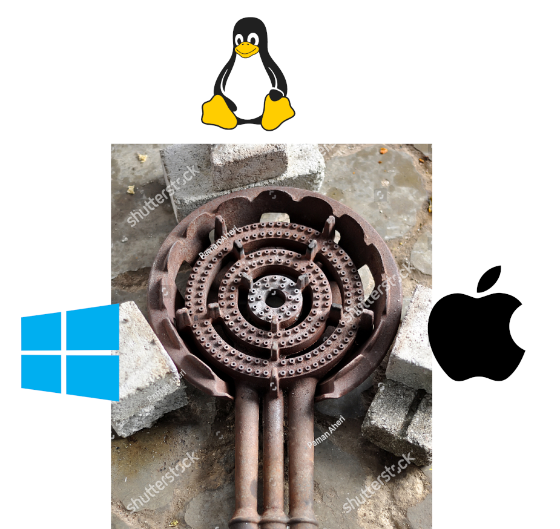

# Portable rust


<!-- Yes i know "shutterstock" is visible. Hopefully this is more legal =D -->

Not actually portable. It's just a hack, but it makes it possible to create a single binary which will run on many
systems.

Systems include anything you like (Windows, Mac, Linux, ARM...), all it requires is a shell to run. For Windows this
means MinGW (git bash) or similar.

### How

* Self-extracting shell script
* Includes one build of your rust app for every target
* Tries to run each app one by one until one hopefully works

### Dependencies

* Shell (sh, bash, fish, zsh, etc.)
* tar
* gunzip
* chmod
* tail
* mktemp

### Release of "hello"

If you like to test the output, here is the "hello" example executable.  
Run on your own responsibility!

[Download from releases](../../releases/latest/download/hello)

Run like this:

```bash
sh hello
```

### Why

For glory!  
Nice for distributing a single file without installer. Say a simple web server.

### Windows

> I want to doubleclick in Windows!

No idea how to achieve this. I know [Cosmopolitan](https://github.com/jart/cosmopolitan) have a hack for it, something
about Windows seeing an executable, while on other systems it becomes a script?  
To do something like that custom-built versions of tar+gunzip+tail+mktemp/mkdir would have to be made, or use built in
programs in Windows as much as possible.